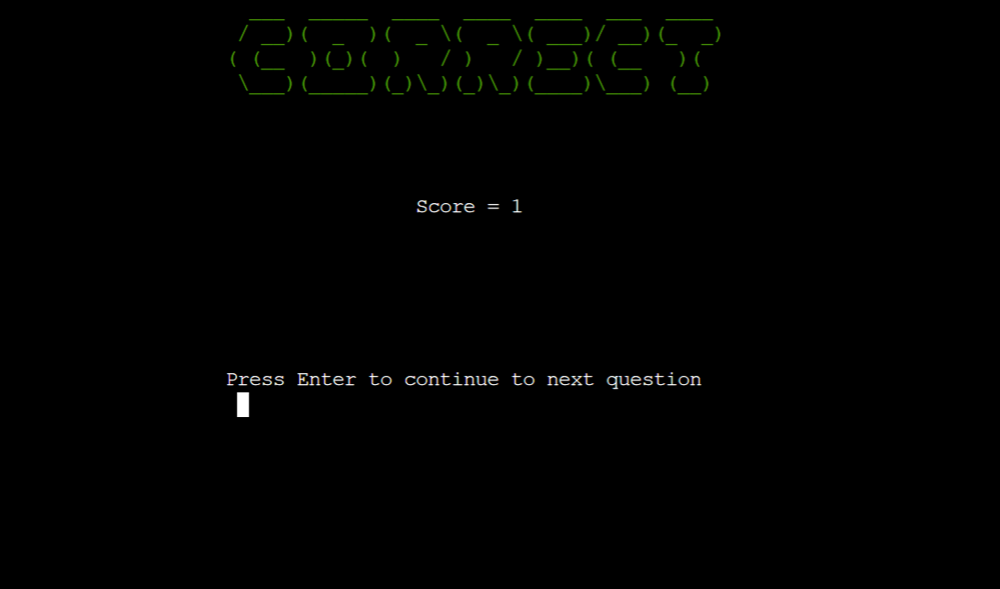

# Smarticus - A Command Line Interface Quiz Game

## Portfolio 3 project as part of the Diploma in Full Stack Software Development by Code Institute.
Smarticus is a Command Line Interface quiz game that allows players to answer 100 multiple choice triva questions in order to get on the High Score Leaderboard.

The live link can be found here - https://smarticus.herokuapp.com/

# Contents

* [Objective](<#objective>)
* [User Experience UX](<#user-experience-ux>)
    * [Target Audience](<#target-audience>)
    * [User Stories](<#user-stories>)
* [Design](<#design-choices>)
    * [Colour Scheme](<#colour-scheme>)
    * [Typography](<#typography>)
* [Features](<#features>)
    * [Flowchart](<#flowchart>)
    * [Page Load](<#page-load>)
    * [How to Play](<#How-to-Play>)
    * [High Score Leaderboard](<#high-score-leaderboard>)
    * [Play Quiz](<#play-quiz>)
    * [Correct Answer](<#correct-answer>)
    * [Incorrect Answer](<#incorrect-answer>)
    * [Score greater than Leaderboard](<#score-greater-than-leaderboard>)
    * [Score less than Leaderboard](<#score-less-than-leaderboard>)
* [Future Features](<#future-features>)
* [Technologies Used](<#technologies-used>)
* [Testing](<#testing>)
    * [Game Testing](<#game-testing>)
    * [Bugs](<#bugs>)
    * [Unfixed Bugs](<#unfixed-bugs>)
    * [Validator Testing](<#validator-testing>)
* [Deployment](<#deployment>)
    * [Deployment to Heroku](<#deployment-to-heroku>)
* [Credits](<#credits>)
    * [Developer Team](<#developer-team>)

# Objective:

Design a clean, fun, and challanging multiple choice quiz in python

The three main objectives are:

* ### Create a fun quiz in python
    The aim of the game is to get on the High Score Leaderboard. The quiz is fun but I also wanted it to be challanging. To add to the challange, if you get one question incorrect, it's game over!
* ### Utilise a trivia API for questions, correct answers, and alternative answer choices
    I used the 'Open Trivia Database' for the free API which can be found at https://opentdb.com/
* ### Use a google sheet to store the high scores list
    I created and connected to a google sheet which stores the high scores list that the quiz accesses

[Back to top](<#contents>)

# User Experience (UX):

## Target Audience

* Users that are looking for a fun, competitive and challanging quiz to play. 

## User Stories

### New Visitor Goals

* Understand what the game is about.
* How to play the game.
* Play the game and get on the Leaderboard!

### Existing Visitor Goals

* Understand what the game is about.
* How to play the game.
* Play the game and improve their score on the Leaderboard!

[Back to top](<#contents>)

# Design Choices

## Colour Scheme

The colour scheme used for this project was only three colors to maintain a simple and clean look. 

* White 
* Yellow
* Cyan

I implemented the colors using the termcolor module.

## Typography

I chose to use the pyfiglet module to generate and color the headers and termcolor to color the font.

[Back to top](<#contents>)

# Features

## Flowchart 

## Page Load

The quiz loads automatically when the site is accessed. The player is presented with 3 options. 1 - Start the quiz, 2 - the rules on how to play, 3 - View the High Score Leaderboard.

## How to Play

This explains how the game works and the objective.

## High Score Leaderboard

The hight score leaderboard shows the top 10 players and their current highest scores.

## Play quiz

When the player starts the quiz, a question, a correct answer and 3 incorrect answers are received from the API and presented to them.

## Correct Answer

When the player answers the question correctly, they are presented with a correct and their score increments by 1. They will then be presented with the question screen once more for the next question.

## Incorrect Answer

When the player incorrectly answers the question, they are presented with an incorrect/game over screen and their score is shown.

## Score greater than Leaderboard

Once the player has answered all 100 questions or they have answered a question incorrectly but their score is still greater than a score on the leaderboard, they will be asked to enter their name so that they can be added to the top 10 on the High Score Leaderboard.

## Score less than Leaderboard

If the player answers incorrectly and their score is not greater than the current scores on the leaderboard, or greater than their previous score, they are presented with the screen to tell them they haven't made it on the leaderboard this time.

[Back to top](<#contents>)

# Future Features

* Implement a countdown timer for each question to add increased difficulty.
* Add options for different question categories and a seperate high score table for each.

[Back to top](<#contents>)

# Technologies Used

Here are a list of technologies used in this project

- [GitHub](https://github.com/) Used to host website
- [Gitpod](https://www.gitpod.io/) Used as IDE
- [Git](https://git-scm.com/) Version control
- [HTML](https://developer.mozilla.org/en-US/docs/Web/HTML) 
- [CSS](https://developer.mozilla.org/en-US/docs/Learn/Getting_started_with_the_web/CSS_basics) 
- [JavaScript](hhttps://www.javascript.com/) 
- [Coloors](https://coolors.co/) Used to display the color palette image in the readme.
- [random Module](https://docs.python.org/3/library/random.html) Used for randomising order of answer choices
- [os Module](https://docs.python.org/3/library/os.html) Used for clearing the terminal
- [time Module](https://docs.python.org/3/library/time.html) Used for holding a screen for 3 seconds before changing
- [Pyfiglet Module](https://pypi.org/project/pyfiglet/0.7/) Used to create colored headings in the terminal
- [Termcolor Module](https://pypi.org/project/termcolor/) Used to add colors to font
- [PEP8 Validator](http://pep8online.com/) Used to check python code for errors
- [Heroku](https://id.heroku.com/login) Used to deploy the project
- [Google Sheets](https://docs.google.com/spreadsheets/u/0/) Used to store top 10 high scorers and their top score.
- [gspread](https://docs.gspread.org/en/latest/) Used as API to enable python to access google sheets.
- [Open Trivia Database](https://opentdb.com/) Used for the questions API
- [Lucid](https://lucid.co/) Used to design the flowchart
- [Adobe Photoshop CS6](https://www.adobe.com/ie/products/photoshop.html) Used to create and edit images used for the website.

[Back to top](<#contents>)

# Testing 

I have spent many many hours testing this site and had friends go through it for me also.

This led to many issues being identified.

There seems to be an issue with it on safari or apple devices but this also was happening for the love sandwiches project so it may be heroku related. I don't have an apple device so I was unable to test this myself.

## Game Testing

| TEST | OUTCOME | PASS / FAIL |
|:---:|:---:|:---:|
| Load menu/welcome page | Main page loads correctly | PASS |
| Input options | User can only input 1, 2, or 3 as options, anything else gives a warning and they are asked to enter again | PASS |
| View Instructions/How to  | When option 2 is selected, you are taken to the game instructions | PASS |
| View High Score Leaderboard | When option 3 is selected, you are taken to the Leaderboard which populates correctly | PASS |
| Return to main menu | you can return from how to and leaderboard windows to the main menu | PASS |
| Start game | When option 1 is selected, you are taken to the first question | PASS |
| Answer input validation | The input will only accept A, B, C, or D and nothing else | PASS |
| Correct answer input | When correct answer is selected, "Correct" is shown and the player's score increments | PASS |
| Incorrect answer input | When incorrect answer is selected, "Incorrect Game Over" is shown and the player's score is shown | PASS |
| Check Score | When the game finishes, the player's score is compared to the leaderboard scores | PASS |
| Score greater than scores in leaderboard | If player's score is higher than in leaderboard, the leaderboard updates | PASS |
| Score less than scores in leaderboard | If player's score is noth higher than leaderboard they are brought to Leaderboard | PASS |
| Incorrect answer input | When incorrect answer is selected, "Incorrect Game Over" is shown and the player's score is shown | PASS |

## Bugs

* The API had ASCII codes in it's questions and answers. I created a function that implemented the HTML parser module to make these readable.
* Player name input was accepting empty string. Added while loop to prevent this.
* As existing leaderboard players score updates and doesn't add a new key:value pair, the leaderboard was presenting with 9 results in these cases. I added code that only deletes entries from the google sheet if there are greater than 10 entries.
* I added exceptions to the Trivia API and google sheet so the program would not crash if they were down.
* High Scores in Leaderboard were very untidy when printed due to name length difference. I created code to add spaces to make all lenghts uniform so the leaderboard looks neat and clean
* The terminal clear function wasn't working on every device, I used 'cls||clear' to resolve this issue.
* I initially had a 
 

## Unfixed Bugs

* To the best of my knowledge there are no further bugs present 

## Validator Testing 

- Python
  - No errors were found when passing through the official [PEP8 validator](docs/images/pep8.png)

[Back to top](<#contents>)

# Deployment

## Deployment to Heroku

* Log into Heroku or create an account if you don't already have one.
* Click 'New' from the top right of the screen.
* Select 'Create new app'.
* Enter a unique application name - select appropriate region.
* Click 'Create app'
* One the following page, click the 'Settings' tab and scroll to Config Vars.
* In the KEY input field, enter 'PORT' and in the VALUE input field, enter '8000'.
* Click 'Add'.
* On the same page, scroll down to buildpacks and add add two buildpacks.
* The ordering for these is heroku/python followed by heroku/nodejs.
* At the top of the page, click 'Deploy.
* Select Github as the deployment method.
* Select your repository name and click the 'Connect'.
* At the bottom of the same page, select either Automatic Deployment or Manual Deployment 
* Wait for your site to be deployed.

[Back to top](<#contents>)

# Credits

[Python Documentation](https://docs.python.org/3/) This was invaluable for figuring out how to use different functions to manipulate the data, from the API especially.

[Code Institute](https://learn.codeinstitute.net/) I used the SCOPE from the love sandwiches project for the Google Sheets API and also refered back to the course material many times.

[Back to top](<#contents>)

## Developer

* Alan Egan - Junior Software Developer at Code Institute

[Back to top](<#contents>)